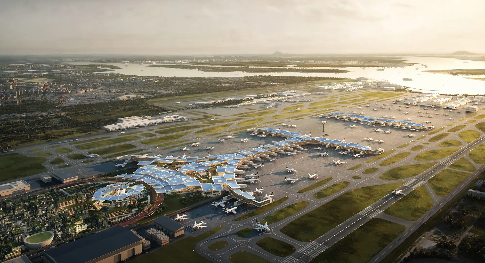
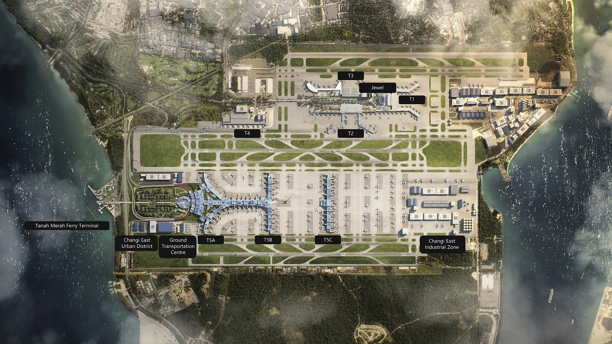

# Использование  BIM-технологий на примере терминала 5 сингапурского аэропорта Чанги

В рамках задания по изучению технологий BIM-проектирования я рассмотрела проект строительства нового терминала в аэропорту "Чанги" в Сингапуре.

> Полное название проекта: Терминал 5 аэропорта "Чанги"  
> Местоположение: Сингапур

Жизненный цикл объекта пока что находится на стадии проектирования; строительство терминала запланировано на первую половину 2025 года. Ожидается, что терминал позволит аэропорту Чанги принимать дополнительно 50 миллионов пассажиров в год, удвоив его текущую пропускную способность. Терминал 5 должен стать последним дополнением к сингапурскому аэропорту.

Целями проекта являются увеличение пропускной способности аэропорта для удовлетворения растущего спроса на авиаперевозки и создание современного и удобного пространства для пассажиров с акцентом на инновационные технологии и гармонию между архитектурой и ландшафтом. Основной концептуальной идеей дизайна терминала стал «зеленый» подход, который отражает многогранную природу Сингапура.

Проект является отличным примером того, как BIM-технологии с использованием ИИ могут облегчить работу над строительством и значительно увеличить его эффективность.

Визуализация проекта от архитектурных студий Kohn Pedersen Fox и Heatherwick Studio выглядит следующим образом:

Терминал 5 аэропорта «Чанги» — это настоящая инновация в авиационной инфраструктуре. BIM-технологии помогли архитекторам визуализировать и структурировать свою идею. 

в проекте BIM-технологии использовались для создания детализированной 3D-модели нового терминала, включая архитектурные, инженерные и строительные компоненты:

- 3D-визуализация объекта помогла команде выявить сложные узлы конструкций, a также отобразить не только общую концепцию терминала, но и каждый аспект целой системы. Применение ИИ для анализа проектных решений позволило оптимизировать планировку пространства и повысить функциональность терминала, учитывая потоки пассажиров и грузов. В результате это помогло избежать потенциальных пересечений (столкновений) объектов, которые на дальнейших этапах проектирования могли бы обойтись компании в крупную сумму и привести к задержкам в поставках материалов или несоответствиям в графике работ.

- С помощью 4D-моделирования удалось точно спланировать последовательность строительных работ. 4D-моделирование предоставляет возможность наглядной демонстрации строительства объекта в зависимости от времени. Такой подход позволил свести к минимуму время простоев и обеспечить эффективное использование ресурсов.
BIM-модель — это также улучшенная координация и коммуникация между командами и менеджерами в режиме реального времени. В ходе проектирования терминала использовались дроны для мониторинга строительной площадки и сбора данных, которые интегрировались в BIM-модель для обновления статуса проекта в реальном времени, что позволяет избежать недопониманий и делает проект более «прозрачным».

По мере завершения строительства терминала работа с BIM-проектом не закончится. Использование BIG DATA вкупе с BIM-технологиями предоставит менеджерам детальную информацию о каждом объекте целой системы терминала, что поможет без задержек реагировать на неисправности или непредвиденные обстоятельства и эффективно решать проблемы. В связи с бурным ростом технологий и инноваций у команд получится быстрее адаптировать различные аспекты системы под изменения.

Таким образом, ключевыми преимуществами использования BIM-технологий в рамках проекта 5 терминала аэропорта «Чанги» в Сингапуре стали своевременное выполнение работ, улучшенная коммуникация между сотрудниками и уменьшение затрат на строительство объекта.