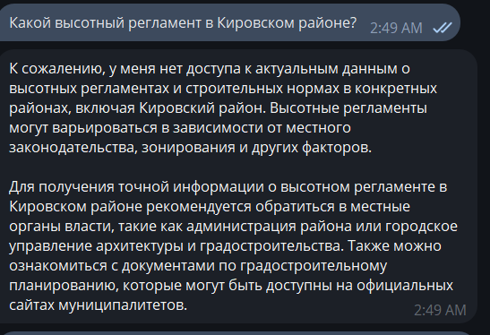

# Пример взаимодействия с чат-ботом в строительной компании, его преимущества и недостатки.
Для задания на тему «Языковые модели и чат-боты в строительстве» я выбрала универсальный ChatGPT. В своей работе я рассматриваю ответы чат-бота на вопросы, связанные непосредственно со строительством и архитектурой, предварительно пообщавшись с архитектором о том, насколько полезны были ответы. Чтобы не загромождать доклад примерами, я указала начала ответов от чат-бота и расписала их ключевые моменты.

### Тест 1. Работа с вентиляционной системой
Ответ от ChatGPT:

*Далее чат-бот даёт инструктаж как проводить обслуживание вентиляционных каналов(регулярная проверка, чистка, замена фильтров), рекомендует согласовать вентканалы с особенностями здания(этажность, планировка), нормами(СНиП, ГОСТ), рекомендует проконсультироваться с профессионалом.*
На мой взгляд, чат-бот даёт лишь справочную информацию, не углубляясь в подробности, кратко перечисляет характеристики и возможности установки вентканалов.
В качестве справки по установке вентканалов — хорошо, но бот мог бы включить в свой ответ стандартные габариты, что является наиболее полезной информацией

### Тест 2. Выбор подходящего строительного решения
Ответ от ChatGPT:

*Далее чат-бот рекомендует определить нагрузочные характеристики на стропильную систему, учитывать климатические особенности, экономические факторы, и на их основе создать проект стропильной системы, соблюдая нормы и правила(СНиП, ГОСТ). Бот напоминает при установке системы соблюдать технологии монтажа и учитывать будущие изменения, не вдаваясь в подробности.*

Аналогично с предыдущим тестом бот выдал информацию в виде краткой справки.

С выбором стропильной системой дела уже обстоят хуже, чем с вентканалами: бот рассказал «обо всём, и ни о чём». Для архитекторов и строителей прежде всего стропила — это деревянные стропила. Когда речь идёт о железных и бетонных конструкциях, специалисты зачастую не используют термин «стропила».
Если же говорить о классических деревянных стропилах, бот мог бы выдать больше информации о системе(например, зависимость от пролёта крыши, от расположения конька)

### Тест 3. Планировка нежилого объекта.
Ответ от ChatGPT:

Бот поясняет:
> «П — парковочные места. Вход/Выход — обозначает зоны, где автомобили могут заезжать и выезжать из парковки.(С) — места для зарядки электромобилей или специальные места для инвалидов (можно выделить несколько таких мест на каждом этаже).
Дополнительные элементы:
-Лестницы и лифты: необходимо предусмотреть лестницы и лифт для удобного доступа между этажами.
-Освещение: хорошее освещение для безопасности.
-Знаки и разметка: четкая разметка для парковочных мест и указатели направления.»

Детальной планировки от подобного бота нельзя ожидать, однако он сам написал, что нужны лифты, если она трехэтажная, но не смог их отобразить на схеме.

### Тест 4. Планировка двухэтажного дома площадью 150 кв км с собственной котельней, прихожей и гаражом. Планировка не должна быть линейной
Ответ от ChatGPT:

Описание бота:
«Первый этаж:
- Гостиная: 40 кв. м
- Кухня и столовая: 25 кв. м
- Ванная комната: 5 кв. м
- Котельная: 5 кв. м
- Гараж: 30 кв. м
- Коридор/прихожая: 10 кв. м
Второй этаж:
- Основная спальня: 20 кв. м
- Дополнительная спальня 1: 15 кв. м
- Дополнительная спальня 2: 15 кв. м
- Ванная комната: 5 кв. м
- Коридор: 5 кв. м

1. Первый этаж:
- Гостиная занимает центральное место, что делает её удобной для общения.
- Кухня и столовая расположены рядом, чтобы обеспечить удобный доступ во время приготовления пищи.
- Ванная комната и котельная находятся в углу для удобства.
- Гараж может быть с отдельным выходом на улицу.
2. Второй этаж:
- Основная спальня расположена в одной части для уединения.
- Две дополнительные спальни могут быть расположены рядом друг с другом, что удобно для семьи.
- Ванная комната на втором этаже обеспечивает доступ к удобствам для всех спален.»

Бот вновь не справился со схематичной планировкой. По видимому, он понимает какие именно помещения на каких этажах должны быть, но не может грамотно их изобразить в текстовом формате.

Из тестов 3 и 4 я сделала вывод, что бот довольно слаб в планировках.

### Тест 5. Состояние рынка строительных материалов
Ответ от ChatGPT:

Бот не в силах дать информацию о состоянии рынка строительных материалов и рекомендует собеседнику посетить другие платформы(маркетплейсы, интернет-магазины).

Я думаю, что было бы полезнее, если бы бот собирал хотя бы приблизительную информацию о стоимости товара на данный момент(если не указана другая дата). Это могло бы соориентировать заказчика в цене и иметь представление о стоимости того или иного товара.

### Тест 6. Выбор материалов
Ответ от ChatGPT:

Бот вновь даёт справочную информацию.

### Тест 7. Регламенты
Ответ от ChatGPT:

С регламентами бот не справляется совсем.

Опять же, будет полезнее, если бот собирал бы приблизительную информацию и выдавал хотя бы краткие выжимки из регламентов.

Хочу подытожить, что ChatGPT отвечает на вопросы, связанные со строительной сферой поверхностно, в общем виде. Его ответы скорее подходят человеку, который решил построить здание, но не имеет представления, с чего начать. Я бы порекомендовала этот чат-бот для развития кругозора в строительстве неподготовленному человеку, но не для профессиональной деятельности.