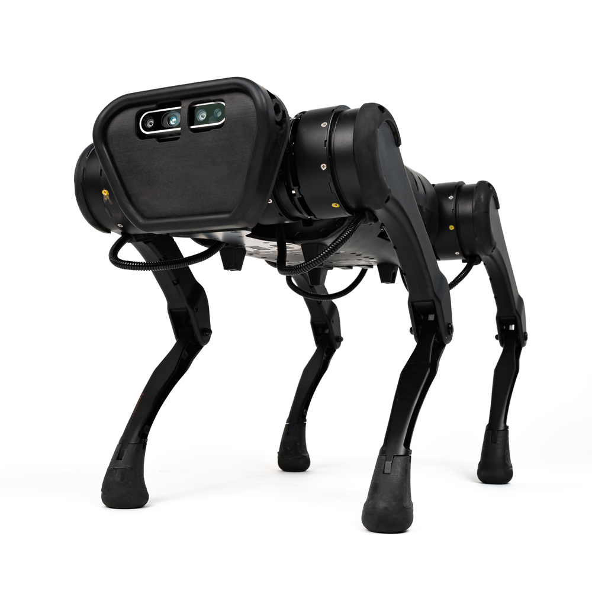

# Роботизированная система инспекции объектов недвижимости

Роботизированные системы ИИ – отличное средство для повышения производительности, безопасности и качества строительных работ, а также для решения проблем нехватки квалифицированной рабочей силы. Роботов применяют для решения таких задач, как демонтаж, 3D-печать, выявление дефектов и недочётов, транспортировка материалов и инструментов, выкладка кирпича, сварочные работы и многих других рутинных задач. Однако использование роботов ещё не достигло своего пика, строительных роботов применяют лишь единицы из обширного количества стройкомпаний. В своей работе я рассмотрела, как робопсы помогают в инспекции и мониторинге.

### Робопёс Unitree A1

Робопес __Unitree A1__ от компании Unitree Robotics – это четвероногий собакоподобный робот, представляет собой усовершенствованную версию предыдущих моделей LaikaGo, XDog и AlienGo. Его задача – автоматизированное выявление нарушений в строительстве и беспорядков в городе.

Робот оснащен передовыми технологиями:
- GPS-система для навигации по заданным маршрутам и отслеживании передвижения робота в режиме real-time.
- Многофункциональный лидар для создания 3D-карт. Такая технология позволяет получить точную трёхмерную модель местности и произвести замеры окружающих объектов недвижимости.
- Интеллектуальная система управления, которая позволяет робопсу быстро адаптироваться к изменяющимся условиям. Робопёс ловко обходит препятствия и не натыкается на прохожих людей.
- Full HD камеры, установленные на робопсе снимают с высоким разрешением и точностью. Они также оснащены противоударной защитой для фото- и видеофиксации.
- Система стабилизации. Робот твёрдо стоит на четырёх «лапах» и передвиается по любым поверхностям. Это весомый фактор, так как поверхность на строительном участке никогда не бывает идеально ровной. Робопёс свободно забирается на различные конструкции, не падет с наклонных поверхностей, а передовая система манёвренности позволяет роботу не упасть, если уж оплошность случилась. Четыре механические опоры также обеспечивают устойчивое движение со скоростью до 11 км/ч
- Экологический след. Робот  Unitree A1 изготовлен из экологически безопасность материалов, что подчёркивает бережливость компании к природе и живым организмам.

Unitree A1 — перспективная модель для внедрения в строительные работы. Робот негабаритен, умело обходит препятствия, никому не мешает, а главное — не устаёт, не теряет внимательности и не уходит на обед или перекур. Поэтому менеджеры и руководители, используя робопса в своём проекте, могут не бояться что-то упустить из виду, так как робот просканирует площадку в срок и моментально выявит отклонения и недочёты.
Ожидается, что Unitree A1 станет неотъемлемой частью в выявлении земельно-имущественных нарушений. В целом, использование роботов в строительстве — это перспективное направление, которое постепенно будет расширяться по мере развития технологий и снижения стоимости робототехники.

### Что можно улучшить в роботизированных системах на стройке?
Первое, что приходит на ум — расширение функционала роботов. Дополнительные сенсоры более детально проанализировать состояние объектов – например, тепловизоры для обнаружения дефектов изоляции, спектрометры для анализа материалов, датчиками влажности/прочности бетона: это увеличит качество строительных работ.

Увеличение автономности, или же, другими словами: уменьшение необходимости человека вовлекаться в системы ИИ в случае непредвиденных обстоятельств. Допустим, заданный маршрут для робопса в настоящий момент не подходит для передвижения (участок дороги перекрыт, произошло обрушение асфальта и образовался овраг, движение по участку ограничено из-за какой-либо сторонней проверки или исследования), тогда робот должен уметь самостоятельно спланировать другой маршрут, учитывая всевозможные препятствия. Искусственный интеллект должен быть способен распознавать более широкий спектр нарушений, основываясь на анализе изображений и данных сенсоров. И, конечно же, незамедлительно сообщать о серьёзных проблемах без участия оператора. Решением такой проблемы я нахожу расширении базы данных робота и непрерывной связью с настоящими событиями в городе.

Робопёс на стройплощадке также может получать задания и маршруты непосредственно из BIM-модели проекта, выстраивать наиболее эффективный маршрут, чтобы собрать полную картину о состоянии объекта, измерить прогресс в работе строителей и быстро выявить новую потенциальную опасность(если такова имеется).
